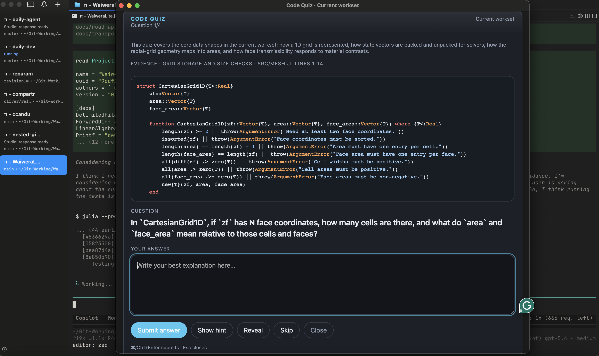

# pi-quiz

Active quiz for code and document understanding in [pi](https://github.com/badlogic/pi-mono).

Instead of summarizing material for you, `pi-quiz` shows a real snippet, asks a question, lets you answer in your own words, gives feedback, and lets you discuss that question further.

## Screenshot



## What it does

- Opens a [Glimpse](https://github.com/hazat/glimpse) quiz window with a snippet, question, and answer box
- Builds quizzes from the current `workset` (inferred active files), `session`, `repo`, or a specific file
- Works with code files, Markdown, LaTeX, PDF, and DOCX
- Uses pi's active model; thinking level defaults to the current setting, capped at `high`, but can be overridden
- Keeps questions anchored to visible snippets
- Gives short feedback plus an ideal answer after you submit
- Lets you open a per-question discussion thread, using broader local source context and recent session context when available
- Can generate an optional end-of-quiz wrap-up report summarising what seems solid, what to revisit, and a suggested next focus
- Supports audience profiles: `general`, `scientist`, `developer`, and `reviewer`

## Commands

- `/quiz` — quiz the current workset (inferred active files)
- `/quiz workset` — explicitly quiz the current workset
- `/quiz session` — quiz files strongly associated with the current session
- `/quiz repo` — quiz repo-level structure and central code
- `/quiz file <path>` — quiz a specific file
- `/quiz --file <path>` — alias for specifying a file explicitly
- `/quiz <path>` — shorthand for `/quiz file <path>` when the path exists
- `/quiz ... --thinking off|minimal|low|medium|high` — override the model thinking level
- `/quiz ... --audience general|scientist|developer|reviewer` — bias the question style for a particular audience
- `/quiz ... --mode gen|sci|dev|rev` — short alias for `--audience`
- `/quiz ... --focus "the introduction and model formulation"` — steer questions toward specific sections or topics
- `/quiz-close` — close the active quiz window

## Audience profiles

- `general` / `gen` — balanced, accessible questions mixing concept and mechanics
- `scientist` / `sci` — focuses on quantities, state representations, transformations, assumptions, perturbations, and intuitive meaning
- `developer` / `dev` — focuses on interfaces, control flow, contracts, extension points, and debugging/refactoring consequences
- `reviewer` / `rev` — focuses on claims, methodology, evidence, assumptions, argument structure, and implications; designed for reading academic papers and theses

`scientist` mode is meant to push the quiz away from software-trivia or pure contract-checking and toward the meaning of the model and what the code is representing.

`reviewer` mode is designed for critical reading of academic documents — it probes what the authors actually claimed, what assumptions underpin the results, where the argument is strongest or weakest, and what would change if an assumption were relaxed.

## Document support

- `.md` and `.tex` files are read directly as text — first-class support
- `.pdf` files are extracted via `pdftotext` (from poppler); install with `brew install poppler` or equivalent
- `.docx` files are extracted via `pandoc`; install with `brew install pandoc` or equivalent
- If equations, tables, or figures look garbled after automatic extraction, consider converting to `.md` or `.tex` first for better results

## Focus

The `--focus` flag lets you steer quiz questions toward specific sections or topics without needing to extract them manually. It affects both **source selection** and **question generation**, so repo-level quizzes can narrow toward a specific mechanism, theme, or section family:

```
/quiz --file thesis.pdf --focus "the introduction and model formulation"
/quiz --file paper.tex --focus "the methods section and assumptions"
/quiz --file solver.jl --focus "the time-stepping logic"
/quiz repo --focus "how the solver advances the flow front"
/quiz repo --mode reviewer --focus "common themes in the abstracts"
```

## Install

From GitHub:

```bash
pi install https://github.com/omaclaren/pi-quiz
```

From npm:

```bash
pi install npm:pi-quiz
```

Try it without installing:

```bash
pi -e https://github.com/omaclaren/pi-quiz
```

After installing, reload or restart pi.

## Notes

- `pi-quiz` is for active recall and understanding, not passive summaries.
- Questions are intended to be answerable from the snippet shown in the quiz window.
- After feedback is shown, you can open a short discussion thread for that card.
- After a set is finished, you can generate more questions from the same scope.
- At completion you can also request a short wrap-up report based on your answers and feedback, then save it to `quiz-feedback/`.
- Quiz packets and quiz runs are stored as hidden session entries.

## Migrating from pi-code-quiz

```bash
pi remove npm:pi-code-quiz
pi install npm:pi-quiz
```

## License

MIT
